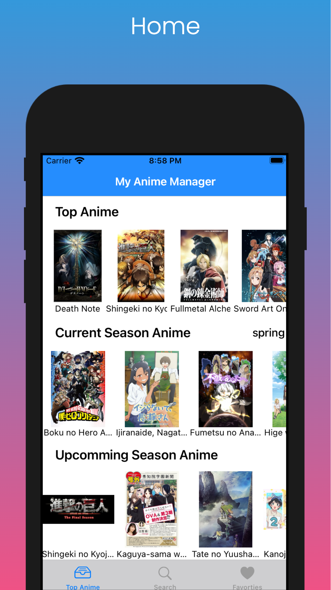
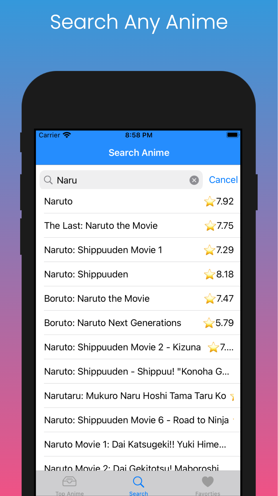
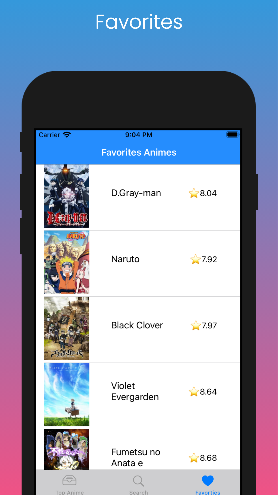
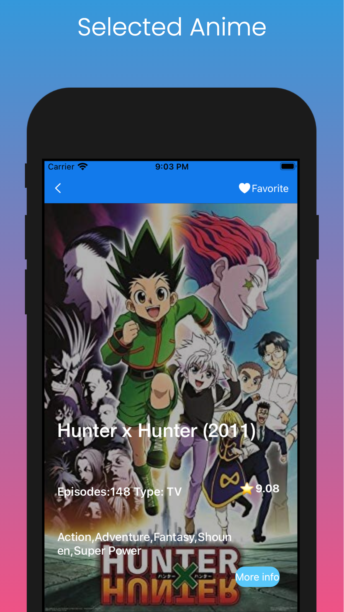
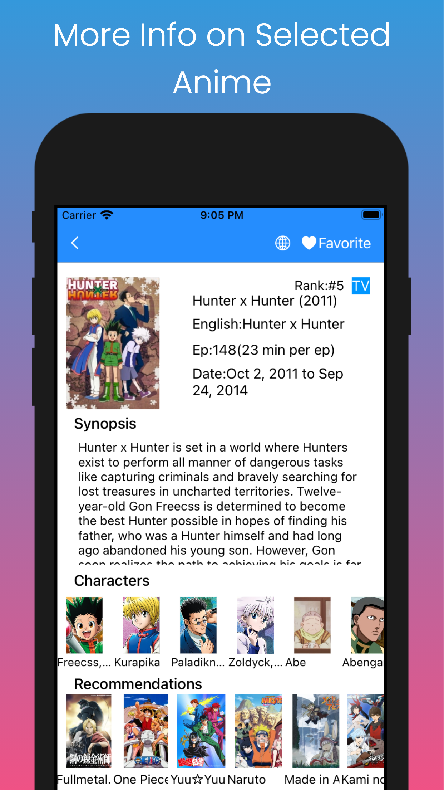

# My-Anime-Manager

## App Features

1. Get Current Top Animes,Current Season Anime(Ongoing Animes) and Upcomming Animes.
2. Search any Anime you like.
3. Shows the Details of the Anime.
4. Set Anime you like as Favorites and store in the app as persistent data
5. Get Recommendations on basis of selected anime
6. For more Info click globe icon that will take you to Anime's MyAnimeList page 
7. Adapts to dark or light mode based on the system.

## Screenshots
  &nbsp; &nbsp;  &nbsp; &nbsp;  &nbsp; &nbsp;  &nbsp; &nbsp;  
## How to build/compile
1. Open "project.xcworkspace" file.
2. Select appropriate simulator.
3. Click the run button or command + R to run the project.

## Requirements
1. Xcode 12
2. Swift 5
3. iOS 14

## API used
https://jikan.moe

## License
This code is free and open source.
